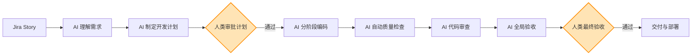

## AI Native SDLC — 项目概览

> **一句话定位：** 从 Jira Story 到代码交付，AI 自动完成开发全流程，人类只在关键决策点介入审批。

---

### 我们在解决什么问题

传统模式下，一个 Story 从需求到代码合并，开发者需要手动完成：理解需求、设计方案、编写代码、自测、修复代码质量问题、提交审查、返修、部署验证。这条链路耗时长、重复劳动多、质量依赖个人经验。

我们的方案是：**让 AI 承担重复性的生产工作，让人类专注于决策和判断。**

---

### 核心流程（一张图看懂）

> 🟧 橙色节点 = 人类决策点。其余全部由 AI 自动完成。

---

### 人类只需要做三件事

| 介入点 | 人类做什么 | 耗时预估 |
| --- | --- | --- |
| **审批开发计划** | 看 AI 生成的方案，确认方向正确 | 5-10 分钟 |
| **最终验收** | 看 AI 列出的问题清单，勾选需要修复的项 | 10-15 分钟 |
| **异常仲裁** | AI 反复修不好时，人类介入指导 | 按需 |

---

### AI 在每个阶段做了什么

| 阶段 | AI 的工作 | 价值 |
| --- | --- | --- |
| **需求理解** | 自动读取 Jira Story、Epic，理解业务上下文 | 消除需求传递损耗 |
| **方案设计** | 生成分阶段开发计划，AI 自审后交人类确认 | 缩短设计周期 |
| **编码开发** | 在 IDE 中自动编写代码，按阶段逐步推进 | 替代重复编码劳动 |
| **质量保障** | 三层自动化检查：语法安全 → 构建规范 → 深度逻辑 | 交付质量内建 |
| **智能分诊** | 自动判断检查问题是否需要修复，不需要的记录原因 | 减少无效返工 |
| **代码审查** | 每阶段自动 Review，全局完成后再做整体 Review | 多层审查零遗漏 |

---

### 质量如何保障

AI 写的每一行代码都必须通过**三道质量关卡**，和人类开发者接受的检查标准完全一致：

| 关卡 | 检查内容 | 类比 |
| --- | --- | --- |
| **第一关** | IDE 实时语法检查 + 代码安全扫描 | 相当于编辑器里的红色波浪线 |
| **第二关** | 项目构建 + 代码规范检查 | 相当于 CI 流水线的 Build 和 Lint |
| **第三关** | 字节码级深度分析 | 相当于资深工程师的逻辑审查 |

任何一关不通过，AI 自动返工或标记交人类处理。**不存在"AI 偷偷提交低质量代码"的可能。**

---

### 对业务代码零侵入

| 原则 | 说明 |
| --- | --- |
| 不改项目依赖 | 不往项目配置里加任何 AI 相关的东西 |
| 不改项目源码 | 不为 AI 在代码里插标记或监控 |
| 工具与代码隔离 | 所有 AI 工具运行在独立环境中 |

**对现有项目和团队的工作方式零干扰。**

---

### 已完成与规划路线图

```mermaid
flowchart LR
    subgraph NOW [当前已实现]
        N1[需求自动抓取]
        N2[AI 方案设计与评审]
        N3[AI 分阶段编码]
        N4[三层质量检查]
        N5[AI 代码审查]
        N6[全局验收与人类返修]
    end

    subgraph NEXT [近期规划]
        X1[重试熔断机制]
        X2[Jira 状态自动流转]
        X3[证据链与审计报告]
    end

    subgraph FUTURE [远期规划]
        F1[Dev 环境自动化测试]
        F2[智能代码知识图谱]
        F3[语义检索增强]
        F4[CR 自动提交]
    end

    NOW --> NEXT --> FUTURE

    style NOW fill:#e6f3ff,stroke:#4a90e2,stroke-width:2px
    style NEXT fill:#fff3e6,stroke:#e6a23c,stroke-width:2px
    style FUTURE fill:#f5f5f5,stroke:#999,stroke-width:1px
```

---

### 预期收益

| 维度 | 预期效果 |
| --- | --- |
| **开发效率** | 常规 Story 的编码和自测时间大幅压缩 |
| **交付质量** | 每行代码经过三层自动化检查，质量标准统一且可追溯 |
| **人力释放** | 开发者从重复编码中解放，专注架构设计和复杂业务逻辑 |
| **知识沉淀** | AI 的每一步决策和豁免原因都有记录，形成可审计的证据链 |
| **风险可控** | 人类在计划和验收两个关键节点把关，AI 不会脱离监管自行交付 |

---

### 一句话总结

> **AI 干活，人类把关，质量内建，全程可追溯。**
