**文档版本**: v2.0  
**日期**: 2026-04-19  
**目标部门**: Digital Security Platform (DSP), ~200 人  
**文档分类**: Internal  
**作者**: Enterprise Architecture Agent

---

## 目录

1. [Executive Summary](https://openwebui.adrian6476.top:8443/c/1d52f966-0e1e-4477-9685-c1c15b5d2ad7#1-executive-summary)
2. [业务愿景与使用场景](https://openwebui.adrian6476.top:8443/c/1d52f966-0e1e-4477-9685-c1c15b5d2ad7#2-%E4%B8%9A%E5%8A%A1%E6%84%BF%E6%99%AF%E4%B8%8E%E4%BD%BF%E7%94%A8%E5%9C%BA%E6%99%AF)
3. [架构设计原则](https://openwebui.adrian6476.top:8443/c/1d52f966-0e1e-4477-9685-c1c15b5d2ad7#3-%E6%9E%B6%E6%9E%84%E8%AE%BE%E8%AE%A1%E5%8E%9F%E5%88%99)
4. [总体架构](https://openwebui.adrian6476.top:8443/c/1d52f966-0e1e-4477-9685-c1c15b5d2ad7#4-%E6%80%BB%E4%BD%93%E6%9E%B6%E6%9E%84)
5. [Ingestion Pipeline 详细设计](https://openwebui.adrian6476.top:8443/c/1d52f966-0e1e-4477-9685-c1c15b5d2ad7#5-ingestion-pipeline-%E8%AF%A6%E7%BB%86%E8%AE%BE%E8%AE%A1)
6. [存储层设计](https://openwebui.adrian6476.top:8443/c/1d52f966-0e1e-4477-9685-c1c15b5d2ad7#6-%E5%AD%98%E5%82%A8%E5%B1%82%E8%AE%BE%E8%AE%A1)
7. [查询与编排层设计](https://openwebui.adrian6476.top:8443/c/1d52f966-0e1e-4477-9685-c1c15b5d2ad7#7-%E6%9F%A5%E8%AF%A2%E4%B8%8E%E7%BC%96%E6%8E%92%E5%B1%82%E8%AE%BE%E8%AE%A1)
8. [知识库作为基础设施：多场景支撑架构](https://openwebui.adrian6476.top:8443/c/1d52f966-0e1e-4477-9685-c1c15b5d2ad7#8-%E7%9F%A5%E8%AF%86%E5%BA%93%E4%BD%9C%E4%B8%BA%E5%9F%BA%E7%A1%80%E8%AE%BE%E6%96%BD%E5%A4%9A%E5%9C%BA%E6%99%AF%E6%94%AF%E6%92%91%E6%9E%B6%E6%9E%84)
9. [安全、合规与治理](https://openwebui.adrian6476.top:8443/c/1d52f966-0e1e-4477-9685-c1c15b5d2ad7#9-%E5%AE%89%E5%85%A8%E5%90%88%E8%A7%84%E4%B8%8E%E6%B2%BB%E7%90%86)
10. [可观测性与运维](https://openwebui.adrian6476.top:8443/c/1d52f966-0e1e-4477-9685-c1c15b5d2ad7#10-%E5%8F%AF%E8%A7%82%E6%B5%8B%E6%80%A7%E4%B8%8E%E8%BF%90%E7%BB%B4)
11. [技术栈总览](https://openwebui.adrian6476.top:8443/c/1d52f966-0e1e-4477-9685-c1c15b5d2ad7#11-%E6%8A%80%E6%9C%AF%E6%A0%88%E6%80%BB%E8%A7%88)
12. [成本拆分](https://openwebui.adrian6476.top:8443/c/1d52f966-0e1e-4477-9685-c1c15b5d2ad7#12-%E6%88%90%E6%9C%AC%E6%8B%86%E5%88%86)
13. [维护策略](https://openwebui.adrian6476.top:8443/c/1d52f966-0e1e-4477-9685-c1c15b5d2ad7#13-%E7%BB%B4%E6%8A%A4%E7%AD%96%E7%95%A5)
14. [实施路线图](https://openwebui.adrian6476.top:8443/c/1d52f966-0e1e-4477-9685-c1c15b5d2ad7#14-%E5%AE%9E%E6%96%BD%E8%B7%AF%E7%BA%BF%E5%9B%BE)
15. [风险评估与缓解](https://openwebui.adrian6476.top:8443/c/1d52f966-0e1e-4477-9685-c1c15b5d2ad7#15-%E9%A3%8E%E9%99%A9%E8%AF%84%E4%BC%B0%E4%B8%8E%E7%BC%93%E8%A7%A3)
16. [未来演进路线](https://openwebui.adrian6476.top:8443/c/1d52f966-0e1e-4477-9685-c1c15b5d2ad7#16-%E6%9C%AA%E6%9D%A5%E6%BC%94%E8%BF%9B%E8%B7%AF%E7%BA%BF)

---

## 1. Executive Summary

### 1.1 项目定位

本方案为 HSBC Digital Security Platform (DSP) 部门设计一套**企业级知识库基础设施（Knowledge Infrastructure Platform, KIP）**。KIP 不是一个单一应用，而是一个**可复用的平台层**——任何需要基于 DSP 代码、文档、运营知识进行智能问答、分析、生成的场景，都可以通过统一的 API 接入 KIP，而无需重复建设 RAG 管线。

### 1.2 核心目标

|目标|描述|
|---|---|
|**平台化**|统一的知识 Ingestion、存储、检索、推理基础设施，支撑多场景（Production Support 仅为第一个场景）|
|**可扩展**|新场景接入只需定义 Prompt Template + 检索策略，无需改动基础设施|
|**合规**|满足 FCA/PRA、SOX 审计要求，Confidential 数据全程加密、可审计|
|**低维护**|全 AWS Managed Services，DevOps 团队兼职 ≤10% 时间可运维|
|**成本可控**|目标 ≤ $40K/月（含 $10K 缓冲）|

### 1.3 关键设计决策摘要

| 决策        | 选择                                                | 理由                                             |
| --------- | ------------------------------------------------- | ---------------------------------------------- |
| 编排框架      | **LlamaIndex**                                    | 企业级成熟度、原生 Bedrock/Neptune/pgvector 集成、代码解析原生支持 |
| 检索策略      | **Hybrid GraphRAG**（向量 + BM25 + 知识图谱三路融合）         | 继承 LightRAG PoC 精髓，适配代码+文档双模态                  |
| LLM       | **Claude Opus 4 / Sonnet 4 / Haiku 4** on Bedrock | 代码理解业界顶级，智能路由控制成本                              |
| Embedding | **Cohere Embed v4** (Text + Image)                | 多模态支持架构图，质量优于 Titan v2                         |
| 图数据库      | **Amazon Neptune Serverless**                     | 代码调用图、依赖图、知识关系图                                |
| 向量数据库     | **Aurora PostgreSQL Serverless v2 + pgvector**    | 已批准、Serverless 自动伸缩、元数据+向量一体                   |
| 全文检索      | **OpenSearch Serverless**                         | BM25 精确匹配类名/方法名/异常名                            |

---

## 2. 业务愿景与使用场景

### 2.1 KIP 的平台定位

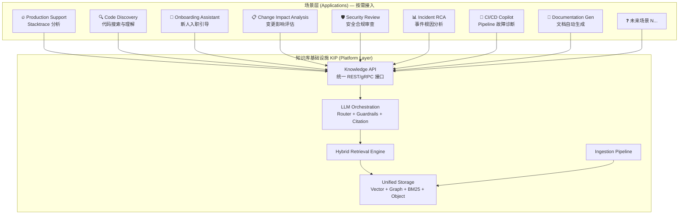

### 2.2 场景详细说明

|场景|描述|知识源|优先级|
|---|---|---|---|
|**Production Support**|输入 Stacktrace，输出根因分析 + 修复建议 + 历史相似事件|代码 + 图谱 + Confluence Runbooks|🔴 P0 (PoC 已验证)|
|**Code Discovery**|"支付服务是如何验证 IBAN 的？" "哪些服务依赖 Redis？"|代码 + 图谱|🔴 P0|
|**Onboarding Assistant**|新人问 "DSP 的整体架构是什么？" "我负责的模块有哪些上下游？"|Confluence + 代码 + 架构图|🟡 P1|
|**Change Impact Analysis**|"如果我修改 `AuthService.validateToken()`，会影响哪些服务？"|图谱 (CALLS/DEPENDS_ON)|🟡 P1|
|**Security Review**|"这个 API 是否有输入校验？" "这段代码是否符合 OWASP Top 10？"|代码 + 合规文档|🟡 P1|
|**Incident RCA**|输入 JIRA Incident ID + 时间窗口，关联代码变更 + 部署记录|图谱 (Commit-modifies-Method) + 部署清单|🟠 P2|
|**CI/CD Copilot**|"这个 Pipeline 为什么失败了？" 输入 build log|Pipeline 代码 + 历史 build 模式|🟠 P2|
|**Documentation Gen**|根据代码自动生成/更新 API 文档、架构文档|代码 + 现有文档（避免重复）|🟠 P2|

### 2.3 场景接入模型

每个新场景接入 KIP 只需提供**三样东西**：

```yaml
# 场景配置示例：production_support.yaml
scene:
  name: "production_support"
  description: "Stacktrace 分析与根因定位"
  
  retrieval_strategy:
    primary: "graph"          # Neptune: 调用链展开
    secondary: "bm25"         # OpenSearch: 精确匹配异常类名
    tertiary: "vector"        # pgvector: 语义相似的历史异常
    fusion: "reciprocal_rank" # RRF 融合
    rerank: true
    top_k: 8

  llm_routing:
    complexity_threshold: 0.7  # Haiku 评分 > 0.7 → Opus 4
    default_model: "sonnet-4"
    complex_model: "opus-4"

  prompt_template: |
    你是 HSBC DSP 部门的高级 Production Support 专家。
    基于以下代码上下文和调用关系图，分析此 Stacktrace 的根因。
    
    ## 规则
    1. 每个事实性陈述必须附引用 [repo/file:line@commitSHA]
    2. 如果无法确定根因，明确说明并建议排查方向
    3. 优先检查最近 30 天的代码变更
    ...

  guardrails:
    require_citations: true
    max_hallucination_rate: 0.20
    pii_detection: true
    
  rbac:
    inherit_github_permissions: true
```

> **新场景接入成本**：一个 YAML 配置 + 可选的自定义 Prompt，**无需修改基础设施代码**。

---

## 3. 架构设计原则

|原则|具体要求|
|---|---|
|**Platform-First**|KIP 是基础设施，非应用。所有场景通过 API + 配置接入，非硬编码|
|**Separation of Concerns**|Ingestion、Storage、Retrieval、Reasoning 四层解耦，各自独立演进|
|**Security by Default**|Confidential 数据全程 KMS CMK 加密（静态+传输）；所有网络走 VPC PrivateLink|
|**Zero-Trust**|每次 API 调用验证 JWT + RBAC；无隐式信任|
|**Audit Everything**|每次查询、每次数据变更、每次权限同步——全部可审计，保留 7 年|
|**Cost-Aware**|智能路由减少 Opus 4 调用；Serverless 组件自动降档；无闲置资源|
|**Graceful Degradation**|图数据库不可用 → 退化为 Vector+BM25；Reranker 不可用 → 退化为 RRF 直出|
|**GitOps**|全部基础设施 Terraform 管理；场景配置存 Git，变更走 PR Review|

---

## 4. 总体架构

### 4.1 总体架构图

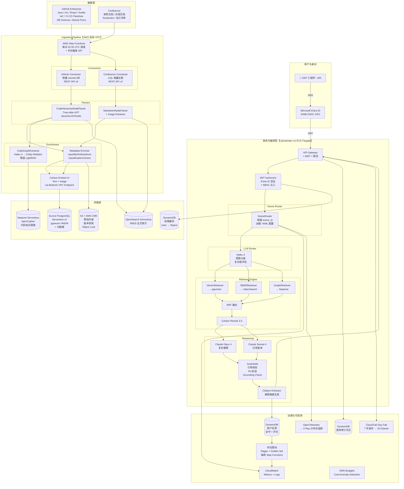

### 4.2 网络拓扑

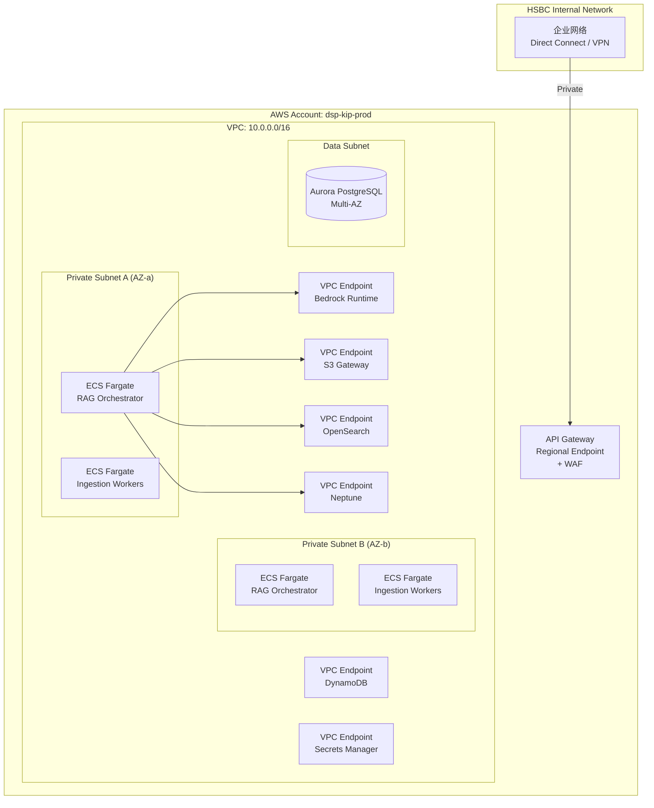

> ⚠️ **关键安全设计**：所有服务间通信走 VPC Endpoint（PrivateLink），**无流量经过公网**。API Gateway 通过 HSBC Direct Connect / VPN 接入企业内网。

---

## 5. Ingestion Pipeline 详细设计

### 5.1 整体流程

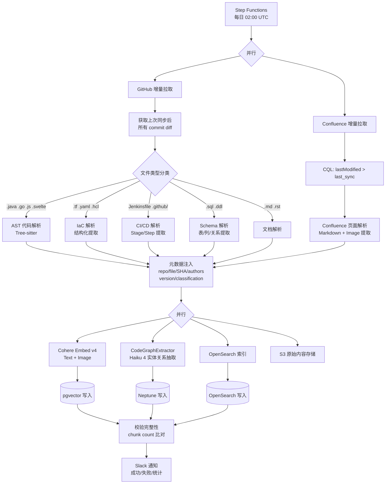

### 5.2 代码解析策略（按语言）

|语言|解析工具|Chunk 粒度|Chunk Header（始终保留）|
|---|---|---|---|
|**Java**|Tree-sitter + JavaParser|Class / Method / Inner Class|`package` + `imports` + `class signature` + `JavaDoc`|
|**Go**|Tree-sitter Go|`func` / `type struct` / `interface`|`package` + `imports`|
|**React (JS/TS)**|Tree-sitter TypeScript|Component (function/class)|`imports` + `prop types`|
|**Svelte**|Tree-sitter HTML + JS|`<script>` / `<template>` 分别处理|Component name + `exports`|
|**Terraform**|HCL Parser|`resource` / `module` / `data` block|`provider` + `variable refs`|
|**CI/CD (YAML/Jenkinsfile)**|自定义 Parser|`stage` / `job` / `step`|Pipeline name + trigger conditions|
|**SQL/DDL**|sqlparse|`CREATE TABLE` / `CREATE PROCEDURE`|Database + Schema|
|**Confluence**|Confluence REST + Beautiful Soup|`<h2>` 节级别|Page title + Space key + breadcrumb|
|**Confluence 图片**|直接提取 `<ac:image>`|整张图作为一个 chunk|Page title + 图片 alt text|

### 5.3 Chunk 元数据 Schema

```json
{
  "chunk_id": "uuid-v4",
  "source_type": "code | confluence | iac | cicd | schema",
  "repo": "payments-service",
  "file_path": "src/main/java/com/hsbc/payment/OrderService.java",
  "symbol_name": "OrderService.processPayment",
  "symbol_type": "method",
  "language": "java",
  "start_line": 42,
  "end_line": 87,
  "commit_sha": "a1b2c3d",
  "branch": "main",
  "is_prod_version": true,
  "authors": ["john.doe@hsbc.com", "jane.smith@hsbc.com"],
  "last_modified": "2026-04-18T10:30:00Z",
  "classification": "confidential",
  "confluence_space": null,
  "confluence_page_id": null,
  "content_hash": "sha256:...",
  "embedding_model": "cohere.embed-v4",
  "chunk_tokens": 512,
  "ingestion_timestamp": "2026-04-19T02:15:00Z"
}
```

### 5.4 增量同步机制

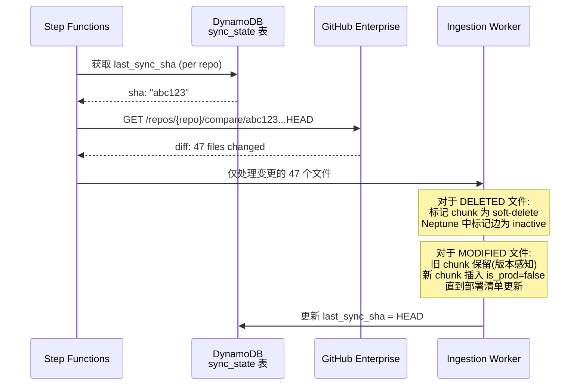

---

## 6. 存储层设计

### 6.1 四层存储架构

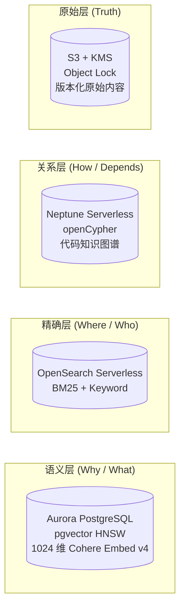

### 6.2 Neptune 图谱 Schema

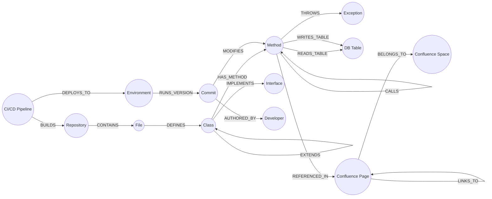

**核心 openCypher 查询示例**：

```cypher
// Stacktrace 分析：从异常方法沿调用链展开 3 跳 + 最近变更
MATCH path = (m:Method {name: 'OrderService.processPayment'})<-[:CALLS*1..3]-(caller:Method)
OPTIONAL MATCH (c:Commit)-[:MODIFIES]->(m) WHERE c.date > datetime() - duration('P30D')
RETURN path, collect(c) as recent_changes
ORDER BY c.date DESC
```

```cypher
// Change Impact Analysis：修改某方法，影响哪些下游？
MATCH (m:Method {name: 'AuthService.validateToken'})-[:CALLS*1..5]->(downstream:Method)
MATCH (downstream)<-[:HAS_METHOD]-(cls:Class)<-[:DEFINES]-(f:File)<-[:CONTAINS]-(r:Repository)
RETURN DISTINCT r.name, f.path, downstream.name
```

### 6.3 pgvector 表设计

```sql
CREATE TABLE knowledge_chunks (
    chunk_id        UUID PRIMARY KEY DEFAULT gen_random_uuid(),
    source_type     VARCHAR(20) NOT NULL,  -- code, confluence, iac, cicd, schema
    repo            VARCHAR(255),
    file_path       VARCHAR(1024),
    symbol_name     VARCHAR(512),
    symbol_type     VARCHAR(50),           -- class, method, function, component, resource, stage
    language        VARCHAR(20),
    start_line      INT,
    end_line        INT,
    commit_sha      VARCHAR(40),
    branch          VARCHAR(255) DEFAULT 'main',
    is_prod_version BOOLEAN DEFAULT false,
    authors         TEXT[],
    last_modified   TIMESTAMPTZ,
    classification  VARCHAR(20) DEFAULT 'internal',
    confluence_space VARCHAR(100),
    confluence_page_id VARCHAR(50),
    content_text    TEXT NOT NULL,
    content_hash    VARCHAR(64),
    embedding       VECTOR(1024) NOT NULL,  -- Cohere Embed v4
    chunk_tokens    INT,
    ingestion_ts    TIMESTAMPTZ DEFAULT NOW(),
    is_deleted      BOOLEAN DEFAULT false,
    
    -- 索引
    CONSTRAINT idx_source UNIQUE (repo, file_path, symbol_name, commit_sha)
);

-- HNSW 向量索引
CREATE INDEX idx_embedding ON knowledge_chunks 
    USING hnsw (embedding vector_cosine_ops) 
    WITH (m = 16, ef_construction = 200);

-- 元数据过滤索引
CREATE INDEX idx_repo ON knowledge_chunks (repo) WHERE NOT is_deleted;
CREATE INDEX idx_prod ON knowledge_chunks (is_prod_version) WHERE NOT is_deleted;
CREATE INDEX idx_source_type ON knowledge_chunks (source_type) WHERE NOT is_deleted;
CREATE INDEX idx_symbol ON knowledge_chunks (symbol_name) WHERE NOT is_deleted;
```

### 6.4 版本感知查询策略

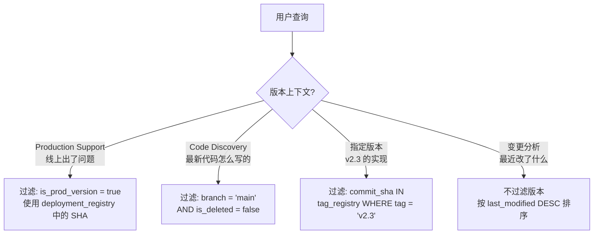

---

## 7. 查询与编排层设计

### 7.1 请求生命周期

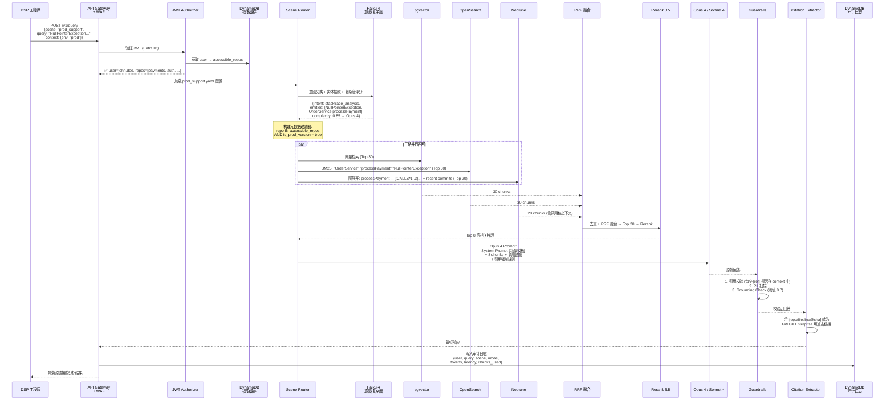

### 7.2 智能 LLM 路由详细设计

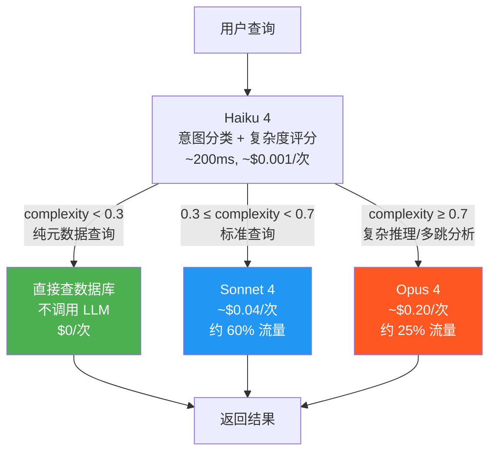

**复杂度评分示例（Haiku 4 Prompt）**：

```
你是查询复杂度评估器。评分 0-1：
- 0.0-0.2: 元数据查询 ("这个文件的作者是谁")
- 0.3-0.5: 单文件/单方法理解 ("这个方法做了什么")  
- 0.5-0.7: 跨文件分析 ("这两个服务如何交互")
- 0.7-0.9: 多跳推理 ("分析这个 stacktrace 的根因")
- 0.9-1.0: 跨领域综合 ("这个变更对安全合规有什么影响")

仅输出 JSON: {"intent": "...", "entities": [...], "complexity": 0.X}
```

### 7.3 Hybrid Retrieval — RRF 融合算法

```python
def reciprocal_rank_fusion(
    vector_results: List[Chunk],
    bm25_results: List[Chunk],
    graph_results: List[Chunk],
    k: int = 60,  # RRF 常数
    weights: dict = {"vector": 1.0, "bm25": 1.0, "graph": 1.5}  # 图谱加权
) -> List[Chunk]:
    """
    三路 RRF 融合。graph_results 权重更高，
    因为代码调用关系对 Stacktrace 分析更有价值。
    """
    scores = defaultdict(float)
    
    for source, results, weight in [
        ("vector", vector_results, weights["vector"]),
        ("bm25", bm25_results, weights["bm25"]),
        ("graph", graph_results, weights["graph"]),
    ]:
        for rank, chunk in enumerate(results):
            scores[chunk.chunk_id] += weight * (1.0 / (k + rank + 1))
    
    sorted_chunks = sorted(scores.items(), key=lambda x: x[1], reverse=True)
    return [get_chunk(cid) for cid, _ in sorted_chunks[:20]]  # Top 20 → Reranker
```

### 7.4 Knowledge API 设计

```yaml
# REST API v1
openapi: "3.0"
info:
  title: KIP - Knowledge Infrastructure Platform API
  version: "1.0"

paths:
  /v1/query:
    post:
      summary: 统一知识查询接口
      requestBody:
        content:
          application/json:
            schema:
              type: object
              required: [scene, query]
              properties:
                scene:
                  type: string
                  description: "场景 ID，对应 YAML 配置"
                  example: "production_support"
                query:
                  type: string
                  example: "java.lang.NullPointerException at com.hsbc.payment..."
                context:
                  type: object
                  properties:
                    environment:
                      type: string
                      enum: [prod, uat, sit]
                    version_filter:
                      type: string
                      enum: [prod_deployed, main_latest, specific_tag]
                    specific_tag:
                      type: string
                stream:
                  type: boolean
                  default: true
      responses:
        200:
          description: 流式响应（SSE）
          content:
            text/event-stream:
              schema:
                type: object
                properties:
                  answer:
                    type: string
                  citations:
                    type: array
                    items:
                      type: object
                      properties:
                        text: { type: string }
                        source: { type: string }
                        github_url: { type: string }
                        relevance_score: { type: number }
                  metadata:
                    type: object
                    properties:
                      model_used: { type: string }
                      total_tokens: { type: integer }
                      latency_ms: { type: integer }
                      retrieval_sources: { type: object }

  /v1/feedback:
    post:
      summary: 用户反馈接口
      requestBody:
        content:
          application/json:
            schema:
              type: object
              required: [query_id, rating]
              properties:
                query_id: { type: string, format: uuid }
                rating: { type: string, enum: [thumbs_up, thumbs_down] }
                comment: { type: string }

  /v1/scenes:
    get:
      summary: 列出所有可用场景
    
  /v1/scenes/{scene_id}:
    get:
      summary: 获取场景详情与配置

  /v1/admin/ingest:
    post:
      summary: 手动触发增量同步
      security: [admin_role]

  /v1/admin/stats:
    get:
      summary: 知识库统计（chunk 数、图谱节点数、查询量）
```

---

## 8. 知识库作为基础设施：多场景支撑架构

### 8.1 场景配置体系

```
kip-config/                          # Git 仓库
├── scenes/
│   ├── production_support.yaml      # P0
│   ├── code_discovery.yaml          # P0
│   ├── onboarding_assistant.yaml    # P1
│   ├── change_impact_analysis.yaml  # P1
│   ├── security_review.yaml         # P1
│   ├── incident_rca.yaml            # P2
│   ├── cicd_copilot.yaml            # P2
│   └── doc_generation.yaml          # P2
├── prompts/
│   ├── system/
│   │   ├── prod_support_system.md
│   │   ├── code_discovery_system.md
│   │   └── ...
│   └── templates/
│       ├── citation_instruction.md   # 通用引用规则
│       └── safety_preamble.md        # 通用安全前缀
├── guardrails/
│   ├── default_guardrails.yaml
│   └── security_review_guardrails.yaml  # 更严格
└── evaluation/
    ├── golden_sets/
    │   ├── prod_support_golden.json   # 200 题
    │   ├── code_discovery_golden.json # 100 题
    │   └── ...
    └── thresholds.yaml               # 各场景质量阈值
```

### 8.2 场景配置详细示例

```yaml
# scenes/change_impact_analysis.yaml
scene:
  name: "change_impact_analysis"
  display_name: "变更影响评估"
  description: "分析代码变更对上下游系统的潜在影响"
  icon: "🔄"
  
  retrieval_strategy:
    primary: "graph"
    graph_query: |
      MATCH (m:Method {name: $method_name})-[:CALLS*1..5]->(downstream:Method)
      MATCH (downstream)<-[:HAS_METHOD]-(cls:Class)
      OPTIONAL MATCH (cls)-[:READS_TABLE|WRITES_TABLE]->(t:Table)
      RETURN downstream, cls, collect(t) as affected_tables
    secondary: "vector"
    tertiary: "bm25"
    fusion: "reciprocal_rank"
    fusion_weights:
      graph: 2.0      # 图谱权重最高 — 影响分析的核心
      vector: 0.8
      bm25: 0.5
    rerank: true
    top_k: 10

  llm_routing:
    complexity_threshold: 0.5   # 变更分析通常较复杂，多用 Opus
    default_model: "sonnet-4"
    complex_model: "opus-4"

  version_context: "main_latest"  # 始终查最新代码

  prompt_template_ref: "prompts/system/change_impact_system.md"
  
  guardrails_ref: "guardrails/default_guardrails.yaml"
  
  output_format:
    sections:
      - name: "直接影响"
        description: "直接调用该方法的上游服务"
      - name: "间接影响"
        description: "2-5 跳内的传递依赖"
      - name: "数据层影响"
        description: "受影响的数据库表和存储过程"
      - name: "风险评估"
        description: "HIGH/MEDIUM/LOW + 建议的测试范围"
      - name: "建议"
        description: "建议的回归测试和通知对象"
```

### 8.3 新场景接入流程

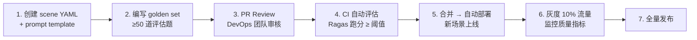

> **接入时间**：一个新场景从提出到上线，预计 **2-3 个工作日**（主要时间花在编写 golden set）。

---

## 9. 安全、合规与治理

### 9.1 安全架构总览

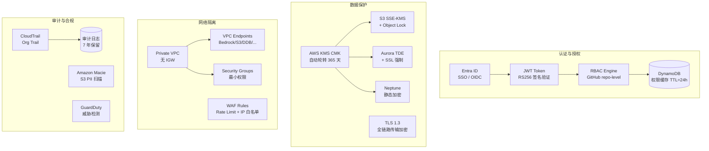

### 9.2 RBAC 权限同步机制

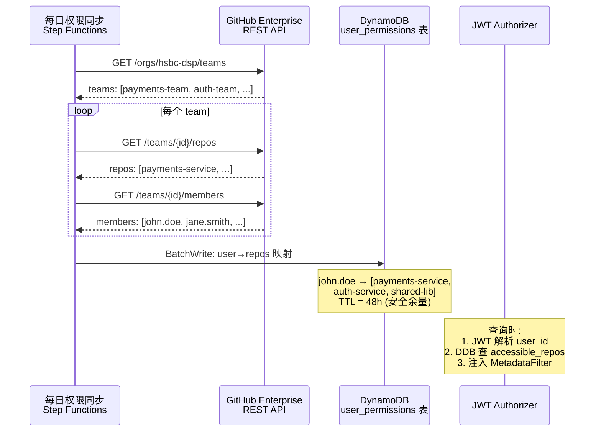

### 9.3 审计日志 Schema

```json
{
  "audit_id": "uuid",
  "timestamp": "2026-04-19T18:30:00Z",
  "user_id": "john.doe@hsbc.com",
  "user_ip": "10.x.x.x",
  "action": "QUERY",
  "scene": "production_support",
  "query_text": "NullPointerException at OrderService...",
  "model_used": "claude-opus-4-7",
  "input_tokens": 12500,
  "output_tokens": 850,
  "latency_ms": 3200,
  "chunks_retrieved": 8,
  "repos_accessed": ["payments-service", "shared-lib"],
  "response_truncated_hash": "sha256:first500chars...",
  "feedback": null,
  "session_id": "uuid"
}
```

**保留策略**：

- DynamoDB TTL = 90 天（热数据，快速查询）
- 到期后自动归档到 S3 Glacier（7 年，SOX 合规）
- Athena 可查询归档数据

### 9.4 FCA/PRA 合规对照

|FCA/PRA 要求|KIP 实现|
|---|---|
|**SYSC 13 — 运营风险管理**|知识库本身提升了 Production Support 效率，降低 MTTR|
|**SYSC 3.2 — 职责分离**|管理员 ≠ 审核员 ≠ 用户，通过 IAM Role + Entra ID Group 实现|
|**FCA PRIN 11 — 与监管者关系**|审计日志可按需导出给 FCA/PRA 审计师|
|**PRA SS1/15 — 外包 & 第三方**|Bedrock/AWS 已在 HSBC 第三方风险管理框架内批准|
|**SOX Section 404**|完整审计追溯 + 变更控制（场景配置走 GitOps PR）|

### 9.5 SOX 职责分离矩阵

|角色|权限|Entra ID Group|
|---|---|---|
|**KIP Admin**|Terraform 部署、基础设施变更|`dsp-kip-admin` (≤3 人)|
|**Scene Author**|创建/修改场景 YAML + Prompt（需 PR Review）|`dsp-kip-scene-author`|
|**Scene Reviewer**|审批场景变更 PR（不能与 Author 同一人）|`dsp-kip-scene-reviewer`|
|**User**|查询知识库|`dsp-kip-user` (全部门 ~200 人)|
|**Auditor**|只读审计日志、评估报告|`dsp-kip-auditor`|

---

## 10. 可观测性与运维

### 10.1 可观测性三支柱

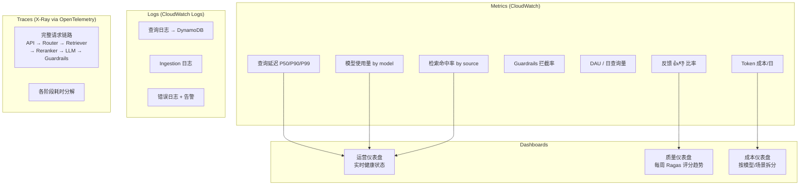

### 10.2 告警规则

|指标|阈值|告警级别|通知渠道|
|---|---|---|---|
|查询延迟 P99|> 15s|🟡 WARN|Slack|
|查询延迟 P99|> 30s|🔴 CRITICAL|Slack + PagerDuty|
|每日 Guardrails 拦截率|> 30%|🟡 WARN|Slack|
|反馈 👎 比率（7日滚动）|> 25%|🔴 CRITICAL|Slack + Email|
|Ragas 周评分|环比下降 > 5%|🟡 WARN|Slack|
|日成本|> $2,000|🟡 WARN|Slack|
|Ingestion 失败|任何仓库失败|🔴 CRITICAL|Slack|
|Neptune / pgvector 不可用|健康检查失败|🔴 CRITICAL|PagerDuty|

### 10.3 反馈闭环与持续改进

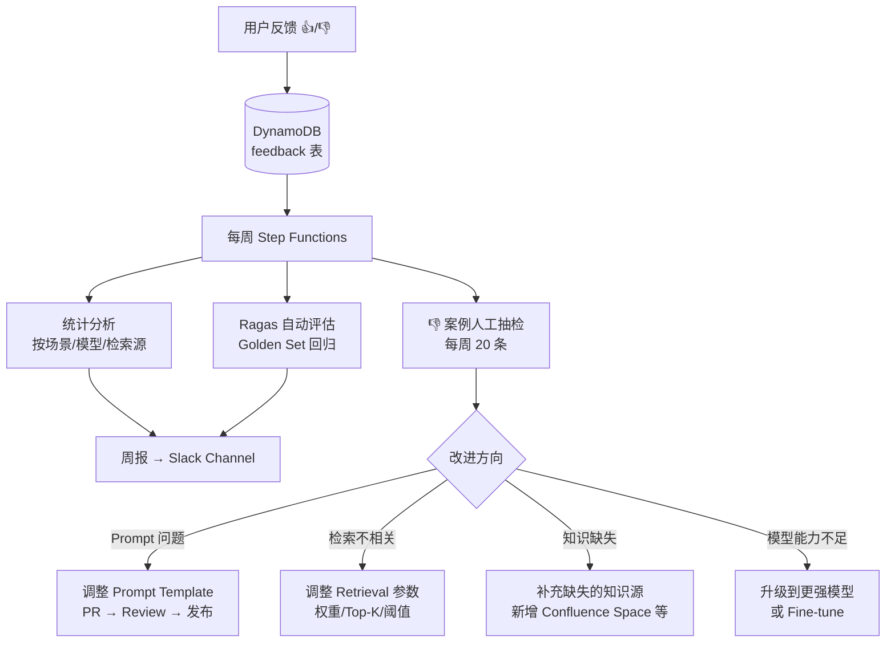

---

## 11. 技术栈总览

|层|组件|技术选择|版本/规格|
|---|---|---|---|
|**身份认证**|SSO|Microsoft Entra ID (OIDC)|—|
|**入口**|API Gateway|AWS API Gateway (Regional) + WAF v2|REST + SSE 流式|
|**编排**|RAG Orchestrator|**LlamaIndex** on ECS Fargate|Python 3.12, LlamaIndex 0.12+|
|**工作流调度**|Pipeline|AWS Step Functions|Express Workflow|
|**主推理 LLM**|复杂任务|**Claude Opus 4** (`claude-opus-4-7`) on Bedrock|VPC Endpoint|
|**日常 LLM**|标准查询|**Claude Sonnet 4** (`claude-sonnet-4-6`) on Bedrock|VPC Endpoint|
|**路由 LLM**|意图分类|**Claude Haiku 4** (`claude-haiku-4-5`) on Bedrock|VPC Endpoint|
|**Embedding**|Text + Image|**Cohere Embed v4** (`cohere.embed-v4:0`) on Bedrock|1024 维|
|**Reranker**|重排|**Cohere Rerank 3.5** (`cohere.rerank-v3-5:0`) on Bedrock|—|
|**向量数据库**|语义检索|Aurora PostgreSQL Serverless v2 + pgvector (HNSW)|2-8 ACU|
|**图数据库**|知识图谱|Amazon Neptune Serverless (openCypher)|2-16 NCU|
|**全文检索**|BM25|OpenSearch Serverless|2 OCU|
|**对象存储**|原始内容|S3 + KMS CMK + Object Lock|—|
|**缓存/审计**|权限 + 日志 + 反馈|DynamoDB On-Demand|—|
|**密钥管理**|—|AWS Secrets Manager + KMS|自动轮转|
|**代码解析**|AST|Tree-sitter (多语言)|Java/Go/JS/Svelte|
|**可观测**|Metrics/Logs|CloudWatch + X-Ray (OpenTelemetry)|—|
|**IaC**|基础设施|Terraform|≥1.7|
|**CI/CD**|部署|GitHub Actions + OIDC → AWS|无长期密钥|
|**代码仓库**|源码|GitHub Enterprise|—|

---

## 12. 成本拆分

### 12.1 月度成本明细

**假设**：200 DAU × 10 查询/天 × 22 工作日 = ~44K 查询/月

| 类别                  | 项目                              | 规格                               | 月成本 (USD) |
| ------------------- | ------------------------------- | -------------------------------- | --------- |
| **LLM — 推理**        | Claude Opus 4                   | 11K 查询 (25%) × ~15K tok          | ~$6,600   |
|                     | Claude Sonnet 4                 | 26K 查询 (60%) × ~11K tok          | ~$1,700   |
|                     | Claude Haiku 4 (路由)             | 44K × 2K tok                     | ~$90      |
| **LLM — Ingestion** | Haiku 4 (图谱抽取)                  | ~200M tok/月                      | ~$200     |
| **Embedding**       | Cohere Embed v4                 | Ingestion ~500M tok + Query ~50M | ~$250     |
| **Reranker**        | Cohere Rerank 3.5               | 44K × 20 docs                    | ~$120     |
| **数据库**             | Aurora PostgreSQL Serverless v2 | 2-8 ACU, ~500GB                  | ~$1,800   |
|                     | Neptune Serverless              | 2-16 NCU (自动                     |           |
